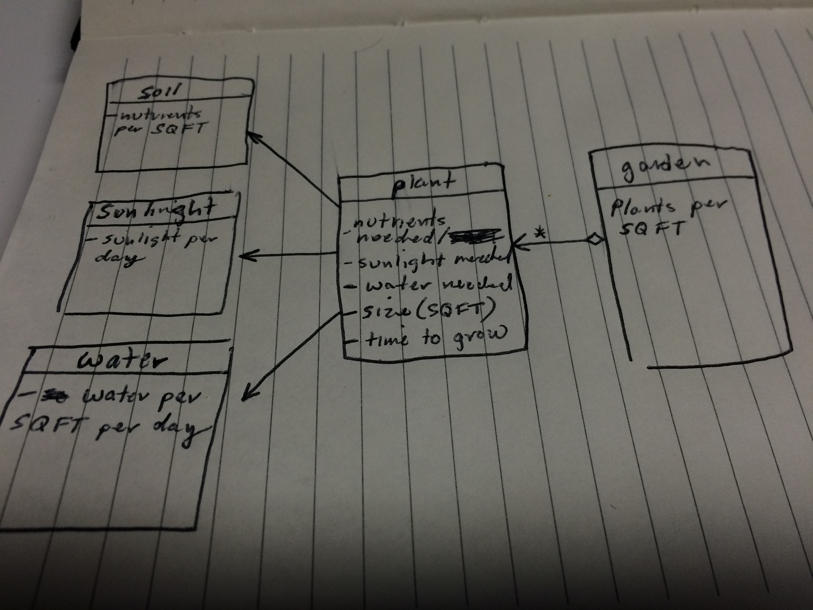

#The Casual Gardener

We created an abstracted model of plants growing within a garden. Each plant has its own growth life (how long it takes to grow) and particular nutrient/sunlight/water daily needs. 

The model runs through a specified number of days (a growing season), and compares the plant's daily needs with the actual values of that day depending on the specified region. 

If the plant's growing conditions are satisfied for that day, we increment its 'Growing Days' by one. If the conditions are not staisfied, the plant will not grow that day. 

If the plant does not meet the growing conditions for 4 consecutive days, the plant dies.

##User Experience

The user chooses a region (city) that is closest to where they live and intend to grow their garden. Each pre-defined region has a minimum and maximum value for soil nutrients, amount of water, and amount of sun per day. 

Then they choose one or more pre-defined plants to grow in their virtual garden, and choose a length of time (in days) for the garden to grow. For each day the garden is simulated, random values for nutrients, water, and sun are generated from the min/max values associated with each city.

If the user neglected to choose any plants, or didn't enter a number of days, a warning will appear asking the user to enter the required information before proceeding.

After clicking "submit", the simulator will run and return the results. The results contain the total days the garden was simulated, as well as a list of plants that lived and a list of plants that died.

##Approach and Analysis

Our approach was to make the website simple and straightforward, as well as a product that is realistically useful and/or interesting for the user. If we had more time, we would have liked to add a feature to display how long it took a plant to "ripen", which would then be displayed for the user in the results section.

###Resources:
* Horizontal nav: [HTML Goodies](http://www.htmlgoodies.com/beyond/css/how-to-create-horizontal-navigation-with-css3.html)
* Submit button: [tympanus](http://tympanus.net/Development/CreativeButtons/)
* Warning message: JavaScript/jQuery book (example code)
* Footer with opacity: [css-tricks](http://css-tricks.com/snippets/css/transparent-background-images/)

